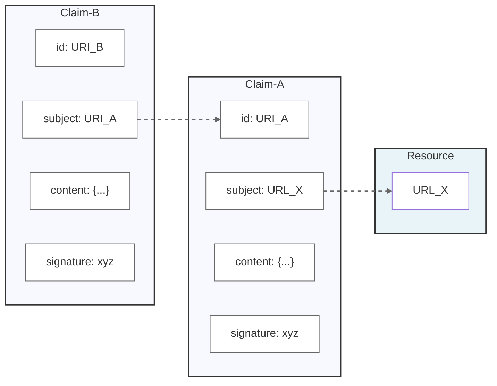
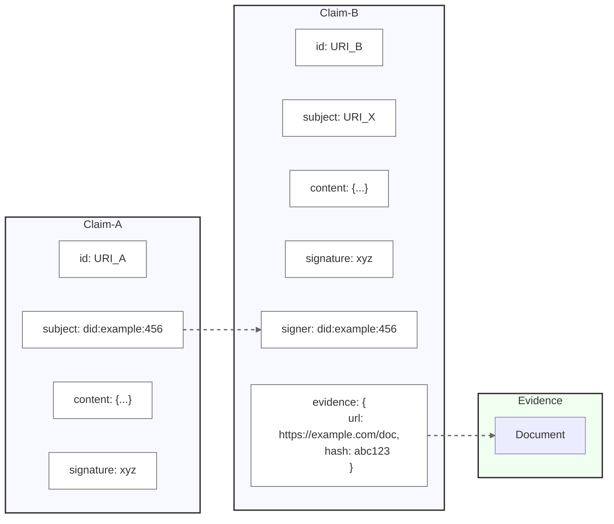
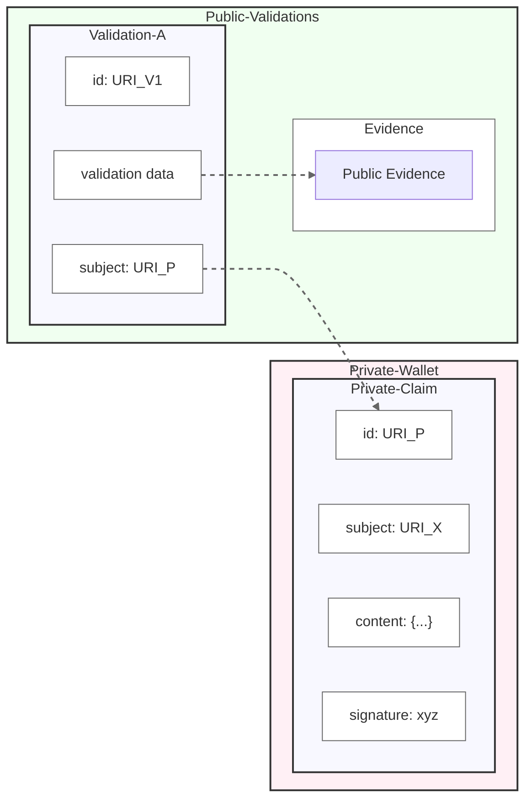

# Linked Claims

Specification Status: Draft

<details>

<style>
dl {
  margin: 1em 0;
}
summary {
  font-weight: bold;
}
dt {
  font-weight: bold;
}
dd {
  margin-left: 2em;
}
</style>

  <summary>More details about this document</summary>
  <dt>Companion Paper:</dt>
  <dd><a href="#">Addressability is The Missing Link (in the Web of Trust)</a></dd>

  <dt>Editors:</dt>
  <dd>Golda Velez</dd>
  <dd>Andor Kesselman</dd>
  <dd>Dmitri Zagidulin</dd>
  
  <dt>Authors:</dt>
  <dd>Golda Velez</dd>
  <dd>Agnes Koinange</dd>
  <dd>Phil Long</dd>
  <dd>(add here as people contribute!)</dd>
  
  <dt>Feedback:</dt>
  <dd><a href="https://github.com/org/repo">GitHub Issues</a></dd>
  
</dl>

</details>

## Abstract

Evaluating the credibiity of digital information about the real world is a difficult problem, one which is not sufficiently addressed by cryptographic signing or blockchain validation.  An open, interoperable, cross-domain web of trust could enable robust credibility assessment; a number of projects pursue this goal.  LinkedClaims is a minimal standard to enable links between independent claims: each claim must be addressable (ie have a URI), must be about an addressable subject, and must be cryptographically signed.  Several desirable features are also identified, such as the ability to make a determinate hash of claim content.  The LinkedClaim pattern already exists in several independent projects and implementations; by defining profiles or mappings for these existing data structures to a LinkedClaim data model, we enable linking them together without requiring changes to their native formats.

This specification defines the fundamental requirements for a claim to be classified as a "linked claim." It introduces the concept of a LinkedClaim profile, outlines how an ecosystem can achieve conformance with the linked claim requirements, and provides guidance on specifying additional requirements through a profile. However, it does not define any specific profile or provide an implementation guide, which are addressed in separate documents.

## Related Work

The LinkedClaims specification is being developed alongside several complementary initiatives:

* [Progressive Trust](TBD) - A framework for building trust through incremental verification and validation of claims
* [digest Multibase Hashlink](TBD) - TBD
* [inbox](TBD) - The use of an ActivityPub compatible inbox for replies to claims

## Status of This Document

Decentralized Web Node is a _DRAFT_ specification under development within the [Decentralized Identity Foundation](https://identity.foundation) (DIF). It is an active work item of the [Linked Claim Incubation Lab at DIF](https://github.com/decentralized-identity/labs/blob/main/proposals/linked_claims/001_proposal.md)  It incorporates requirements and learnings from diverse stakeholders across sectors into a shared specification that meets the collective needs of the community.

The specification will be updated to incorporate feedback, from DIF members and the wider community, with a reference implementation being developed that exercises the features and requirements defined here. We encourage reviewers to submit [GitHub Issues](https://github.com/decentralized-identity/labs-linkedclaims/issues) as the means by which to communicate feedback and contributions.

## Terminology

[[def:DID]]
~ A Decentralized Identifier as defined in https://www.w3.org/TR/did-core/

[[def:Linked Claim]]
~ A structured, cryptographically signed document with a URI subject that is itself addressable at a URI, following at least the MUST requirements detailed below.

[[def:Signer]]
~ The entity that cryptographically signs a claim (known as the "issuer" in Verifiable Credentials)

[[def:URI]]
~ a Uniform Resource Identifier as defined in https://datatracker.ietf.org/doc/html/rfc3986

## Core Pattern



<div class="caption">In this example. Claim-A makes a statement about some existing subject with a URL. Claim-A itself has an identifier, URI_A, and Claim-B uses this to make a statement about Claim-A.  For example, Claim-B might be a corroboration or a rejection of Claim-A</div> 

---

## LinkedClaim Conformance Requirements

A LinkedClaim:

* **MUST** have a subject that can be any valid [URI](https://datatracker.ietf.org/doc/html/rfc3986)
* **MUST** itself have an identifier that is a well-formed URI (URN is acceptable)
* **MUST** be cryptographically signed, such as with a DID
* **SHOULD** provide a mechanism to retrieve deterministic machine-readable content from its URI
* **SHOULD** include a date that is in the signed data
* **SHOULD** contain evidence such as links to a source or attachments, optionally hashlinked
* **SHOULD** have a URI-addressable cryptographic signer
* **MAY** have a narrative statement
* **MAY** have a subject that itself is a claim
* **MAY** be a W3C Verifiable Credential or similar digital credential specification
* **MAY** provide a way for the signer to mutate or revoke the claim
* **MAY** provide an inbox or reply-to address to notify of claims made about this claim
* **MAY** have a separate published date and effective date
* **MAY** be public or access controlled

## Advanced Patterns 

_enabled by implementing the SHOULD recommendations_

### Signer Attestation and Content Integrity Pattern

<div class="caption">Here Claim-A makes an attestation specifically about the signer of Claim-B.  Claim-B also has an evidence field which points to an external URL, and includes a hash of the evidence contents to ensure integrity.</div> 

---

### Public evidence supporting a Private Claim



<div class="caption">In this pattern, we have a Private-Claim held in a Private-Wallet, which the holder may choose to show upon request; in addition a public Validation-A has been made of Private-Claim, with evidence, which a viewer can see and assemble together with the presented private claim.  Viewers without access to the private claim will only see the validation without the private claim details (perhaps containing personal information).</div> 

---

## Minimal Example

Fulfills only the MUST requirements.

```
{
  "id": "https://claims.example.com/claim/123",
  "subject": "https://resource.example.com/entity/456",
  "signature": {
    "type": "Ed25519Signature2020",
    "verificationMethod": "did:example:abc#key-1",
    "signatureValue": "zQeVbY4oey5q66..."
  }
}
```

## Advanced Example

Fulfills MUST requirements and nearly all of the recommendations:

* **SHOULD** include a date that is in the signed data
* **SHOULD** contain evidence such as links to a source or attachments, optionally hashlinked
* **SHOULD** have a URI-addressable cryptographic signer
* **MAY** have a subject that itself is a claim
* **MAY** be a W3C Verifiable Credential or similar digital credential specification
* **MAY** provide a way for the signer to mutate or revoke the claim
* **MAY** provide an inbox or reply-to address to notify of claims made about this claim
* **MAY** have a separate published date and effective date
* **MAY** be public or access controlled

```
{
  "@context": [
    "http://cooperation.org/credentials/v1/",
    "https://w3id.org/security/v2"
  ],
  "type": "LinkedClaim",
  "id": "https://claims.example.com/claim/123",
  "object": "https://resource.example.com/entity/456",
  "statement": "This resource has been verified as meeting quality standards",
  "effectiveDate": "2024-01-06T13:42:19Z",
  "intendedAudience": {
    "type": "OAuth2Audience",
    "id": "https://api.example.com",
    "scope": ["read:claims"]
  },
  "source": {
    "type": "ClaimSource",
    "id": "https://evidence.example.com/doc/789",
    "digestMultibase": "zQmWvQxTqbG2Z9HPJgG57jjwR154cKhbtJenbyYTWkjgF3e",
    "dateObserved": "2024-01-06T12:00:00Z",
    "howKnown": "direct observation",
    "retrieveFrom": "https://evidence.example.com/doc/789"
  },
  "respondAt": "https://claims.example.com/claim/123/responses",
  "aspect": "quality verification",
  "confidence": 0.95,
  "proof": {
    "type": "Ed25519Signature2020",
    "created": "2024-01-06T13:42:19Z",
    "verificationMethod": "did:example:abc#key-1",
    "proofPurpose": "assertionMethod",
    "proofValue": "zQeVbY4oey5q66..."
  }
}
```

## Specific Recommendations

### * **SHOULD** contain evidence such as links to a source or attachments, optionally hashlinked

The hashlink should follow the VC Data Model 2.0 spec, specifically the section on Integrity of Related Resources:  https://www.w3.org/TR/vc-data-model-2.0/#integrity-of-related-resources

### **MAY** provide an inbox or reply-to address to notify of claims made about this claim

It is recommended that the *inbox* for a claim behave similar to the ActivityPub inbox as defined at https://www.w3.org/TR/activitypub/#inbox , in particular it should receive HTTP Post requests notifying of claims made about this claim, and return ordered collection of accepted attestations.

Note that the inbox should NOT be required to retain or accept all submitted claims.

## Deterministic vs Human-readable content

A tension exists between providing a human-readable URL, and a machine readable and hashable data structure that can be referenced in a way to guarantee content integrity.  Providing two distinct views does not guarantee that the data in the human readable view is the same as the machine readable data.

...to be continued.
