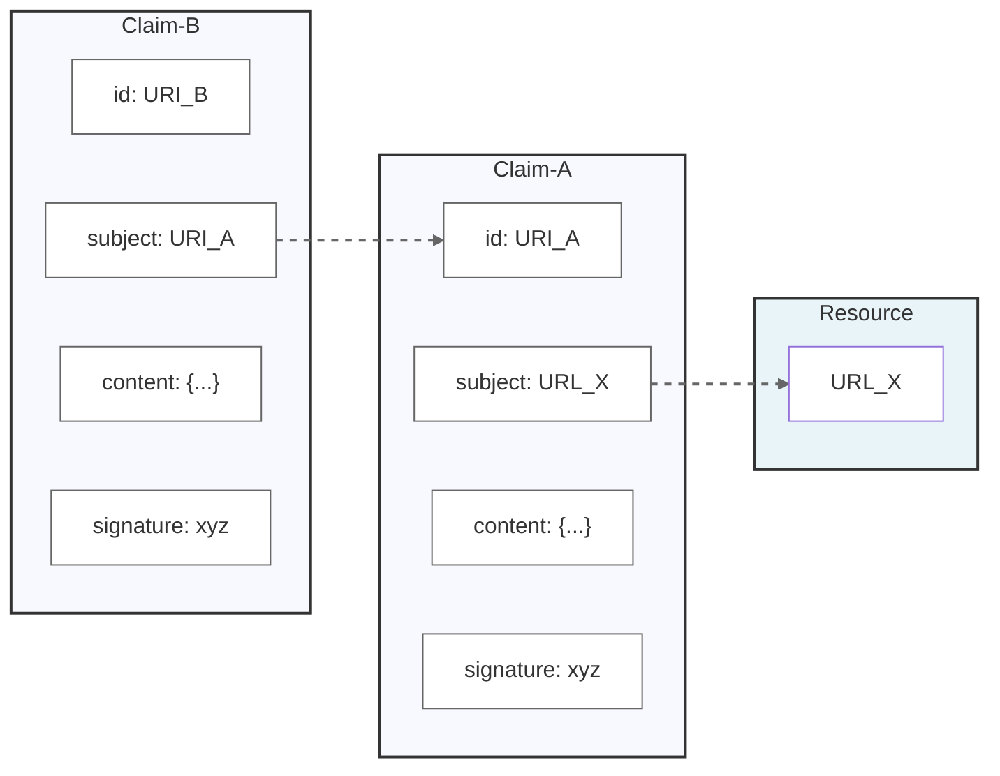

# Linked Claims

Specification Status: Draft

  
More details about this document

  <dt>Companion Paper:</dt>
  <dd><a href="#">Addressability is The Missing Link (in the Web of Trust)</a></dd>

  <dt>Editors:</dt>
  <dd>Golda Velez</dd>
  <dd>Andor Kesselman</dd>
  <dd>(add here as people contribute)</dd>
  
  <dt>Authors:</dt>
  <dd>Golda Velez</dd>
  <dd>Agnes Koinange</dd>
  <dd>Phil Long</dd>
  <dd>(add here as people contribute!)</dd>
  
  <dt>Feedback:</dt>
  <dd><a href="https://github.com/org/repo">GitHub Issues</a></dd>
  
</dl>

## Abstract

Evaluating the credibiity of digital information about the real world is a difficult problem, one which is not sufficiently addressed by cryptographic signing or blockchain validation.  An open, interoperable, cross-domain web of trust could enable robust credibility assessment; a number of projects pursue this goal.  LinkedClaims is a minimal standard to enable links between independent claims: each claim must be addressable (ie have a URI), must be about an addressable subject, and must be cryptographically signed.  Several desirable features are also identified, such as the ability to make a determinate hash of claim content.  The LinkedClaim pattern already exists in several independent projects and implementations; by defining profiles or mappings for these existing data structures to a LinkedClaim data model, we enable linking them together without requiring changes to their native formats.

This specification defines the fundamental requirements for a claim to be classified as a "linked claim." It introduces the concept of a LinkedClaim profile, outlines how an ecosystem can achieve conformance with the linked claim requirements, and provides guidance on specifying additional requirements through a profile. However, it does not define any specific profile or provide an implementation guide, which are addressed in separate documents.

## Related Work

The LinkedClaims specification is being developed alongside several complementary initiatives:

* [Progressive Trust](TBD) - A framework for building trust through incremental verification and validation of claims
* [digest Multibase Hashlink](TBD) - TBD
* [inbox](TBD) - The use of an ActivityPub compatible inbox for replies to claims

## Status of This Document

Decentralized Web Node is a _DRAFT_ specification under development within the [Decentralized Identity Foundation](https://identity.foundation) (DIF). It is an active work item of the [Linked Claim Incubation Lab at DIF](https://github.com/decentralized-identity/labs/blob/main/proposals/linked_claims/001_proposal.md)  It incorporates requirements and learnings from diverse stakeholders across sectors into a shared specification that meets the collective needs of the community.

The specification will be updated to incorporate feedback, from DIF members and the wider community, with a reference implementation being developed that exercises the features and requirements defined here. We encourage reviewers to submit [GitHub Issues](https://github.com/decentralized-identity/labs-linkedclaims/issues) as the means by which to communicate feedback and contributions.

## Terminology

[[def:DID]] ~ A Decentralized Identifier as defined in https://www.w3.org/TR/did-core/

[[def:Linked Claim]] ~ A structured, cryptographically signed document with a URI subject that is itself addressable at a URI, following at least the MUST requirements detailed below.

[[def:Signer]] ~ The entity that cryptographically signs a claim (known as the "issuer" in Verifiable Credentials)

[[def:URI]] ~ a Uniform Resource Identifier as defined in https://datatracker.ietf.org/doc/html/rfc3986

## Core Pattern

## LinkedClaim Conformance Requirements

A LinkedClaim:

* **MUST** have a subject that can be any valid URI
* **MUST** itself have an identifier that is a well-formed URI (URN is acceptable)
* **MUST** be cryptographically signed, such as with a DID
* **SHOULD** provide a mechanism to retrieve deterministic machine-readable content from its URI
* **SHOULD** include a date that is in the signed data
* **SHOULD** contain evidence such as links to a source or attachments, optionally hashlinked
* **SHOULD** have a URI-addressable cryptographic signer
* **MAY** have a narrative statement
* **MAY** be a W3C Verifiable Credential or similar digital credential specification
* **MAY** provide a way for the signer to mutate or revoke the claim
* **MAY** have a subject that itself is a claim
* **MAY** have a separate published date and effective date
* **MAY** be public or access controlled

